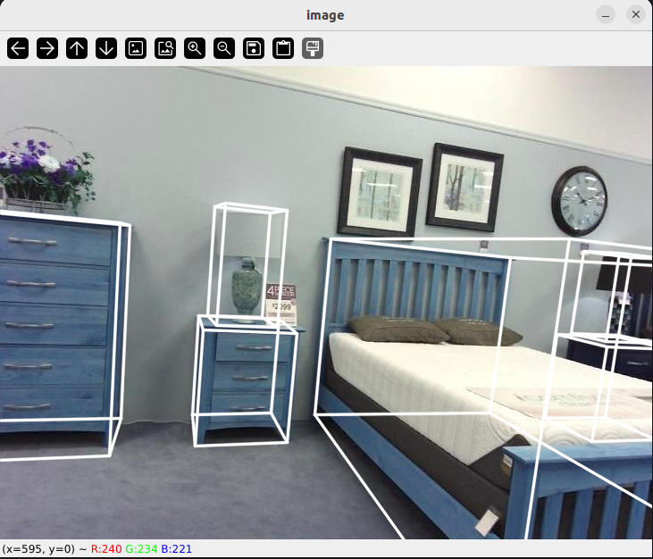

# SETUP

```bash

# Clone repo 
git clone git clone https://github.com/MRamazan/Extract-SunRGBD-Data

# Setup
cd Extract-SunRGBD-Data
python3 -m venv venv
source venv/bin/activate

# Extract data
# You can set classes in extract_sunrgbd_data.py file
python3 extract_sunrgbd_data.py --save_folder "sunrgbd_labels" --save True --save_imgs True --save_pcd True --save_votes False --sample_point_count 100000

```

## PCD load

```bash 
#pcd: [N,6] point cloud data created from depth image 
#np.array([N, 6]) N = number of points 
pcd = np.load("pcd/000001.npz") 
points = pcd[:, 0:3] 
colors = pcd[:, 3:6]
```


## Calib load

calib: {Rtilt: [[x,x,x],[x,x,x],[x,x,x]], K:[[fx,0,cx],[0,fy,cy],[0,0,1]]}    <br> 
label: [classname, centroid1,centroid2,centroid3,w,l,h,orientation1,orientatio2]
```bash 
with open("calib/000001.txt", "r") as file:
     calib = json.load(file)
     Rtilt = calib["Rtilt"]
     K = calib["K"]
#np.load("votes/000001.npz")
```
<br><br>

# VISUALIZE

```bash
python3 visualize.py --image_index 11 --visualize_function 1
```
<br>


```bash
python3 visualize.py --image_index 11 --visualize_function 2
```


