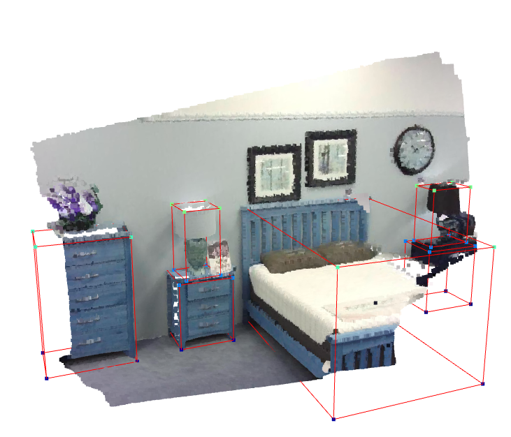

Extracts:  
image: 000001.jpg,... 
depth: 000001.png,... 

label:[classname, centroid1,centroid2,centroid3,w,l,h,orientation1,orientatio2]

pcd: [N,6] point cloud data created from depth image  
     np.array([N, 6]) N = number of points  
     pcd = np.load("pcd/000001.npz")  
     points = pcd[:, 0:3] , colors = pcd[:, 3:6]

calib: {Rtilt: [[x,x,x],[x,x,x],[x,x,x]], K:[[fx,0,cx],[0,fy,cy],[0,0,1]]}         
with open("calib/000001.txt", "r") as file: 
     calib = json.load(file) 
Rtilt = calib["Rtilt] 
K = calib["K"] 
votes: np.load("votes/000001.npz")  

VISUALIZE PCD: 
 

